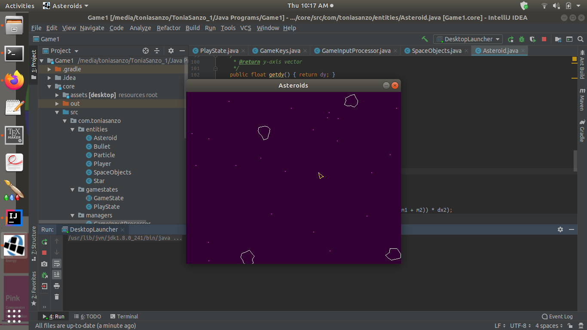
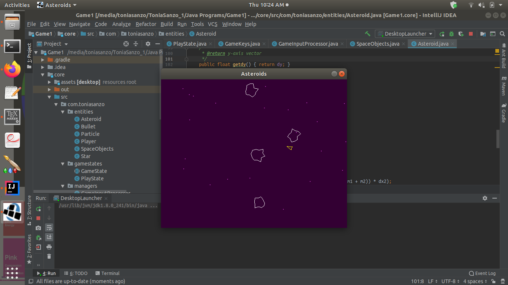
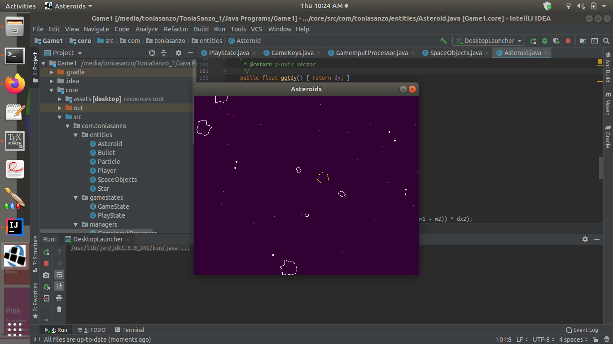

# Asteroids
Asteroids, built with LibGDX to familariaze myself with game programming in Java.

Majority of the code belongs to ForeignGuyMike, the asteroid 2-D elastic collision physics was added by myself.
Use this code freely as you want, for educational and fun uses.

Gameplay Pictures
 
 
 
 
